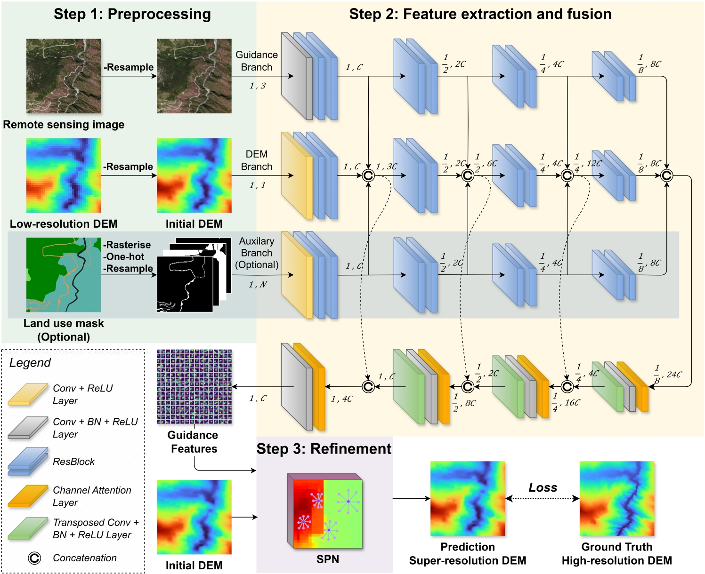

## JSPSR: Joint Spatial Propagation Super-Resolution Networks for Enhancement of Bare-Earth Digital Elevation Models from Global Data

[Paper](https://www.mdpi.com/2072-4292/17/21/3591#)



### Environment
```
Docker Image:
    nvcr.io/nvidia/pytorch:23.10-py3

Within Docker:
    Python 3.10
    CUDA 12.4
    cuDNN 9.0.0
    PyTorch 2.1.0
    Torchvision 0.16
    OpenCV 4.7.0
```
The Dockerfile is provided in the repository for easy setup.

### Dataset

**DFC30**: **D**FC2022 + **F**ABDEM/FathomDEM + **C**opernicus GLO-**30**

DFC30 dataset is available at [here](JSPSR.jpg) and the data structure is:

```
.
├── DFC30_source
│    ├── City_1
│    │    ├── BDORTHO       (RGB images, resolution: 0.5m)
│    │    ├── RGEALTI       (DEMs, resolution: 1m)
│    │    ├── UA2012        (Land use masks, resolution: 1m)
│    │    ├── CHM           (HighResCanopyHeight canopy height map, resolution: 1m)
│    │    ├── COP30         (Copernicus GLO-30 DEMs, resolution: around 30m)
│    │    ├── FABDEM        (FABDEM DEMs, resolution: around 30m)
│    │    └── FATHOM        (Fathom DEMs, resolution: around 30m)
│    ├── ...
│    └── City_16
│         ├── ...
│         └── FathomDEM
├── DFC30_3m
│    ├── City_1
│    │    ├── BDORTHO       (RGB images, resolution: 3m)
│    │    ├── RGEALTI       (DEMs, resolution: 3m)
│    │    ├── UA2012        (Land use masks, resolution: 3m)
│    │    ├── CHM           (HighResCanopyHeight canopy height map, resolution: 3m)
│    │    ├── COP30         (Copernicus GLO-30 DEMs, resolution: 3m)
│    │    ├── FABDEM        (FABDEM DEMs, resolution: 3m)
│    │    └── FATHOM        (Fathom DEMs, resolution: 3m)
│    ├── ...
│    └── City_16
│         ├── ...
│         └── FATHOM
└── DFC30_8m
     ├── City_1
     │    ├── BDORTHO       (RGB images, resolution: 8m)
     │    ├── RGEALTI       (DEMs, resolution: 8m)
     │    ├── UA2012        (Land use masks, resolution: 8m)
     │    ├── CHM           (HighResCanopyHeight canopy height map, resolution: 8m)
     │    ├── COP30         (Copernicus GLO-30 DEMs, resolution: 8m)
     │    ├── FABDEM        (FABDEM DEMs, resolution: 8m)
     │    └── FATHOM        (Fathom DEMs, resolution: 8m)
     ├── ...
     └── City_16
          ├── ...
          └── FABDEM
```

### Usage

#### Training script example

```bash
# train JSPSR model
# 8m resolution - image guidance
python main.py --config configs/jspsr_r8_img.yml
# 3m resolution - image and mask guidance
python main.py --config configs/jspsr_r3_img_msk.yml
```

#### Validating script example

```bash
# test JSPSR model weight
# 8m resolution - image guidance
python main.py --config configs/jspsr_r8_img.yml --val
# 3m resolution - image and mask guidance
python main.py --config configs/r3_128_img_msk.yml --val
```
Note: Specify the path to the pretrained checkpoint file in the config file before validation.


### Pretrained models

#### Weight trained on DFC30 dataset.
| Methods | Pretrained Weight                                                                                     |   Task    | Guidance | RMSE[m] | PSRN[dB] |
|:-------:|-------------------------------------------------------------------------------------------------------|:---------:|:--------:|:--------:|:--------:|
|  JSPSR  | [download link](https://drive.google.com/drive/folders/1eL41Dd6A8iGmKrf_Igw9-Xr0iG8GcWiE?usp=sharing) | 30m to 8m | Image |  1.1094  | 58.4587  |

### Acknowledgments

This work was supported by the [Geospatial Research Institute](https://geospatial.ac.nz/) at the University of Canterbury. The authors would like to thank [Matthew Wilson](https://profiles.canterbury.ac.nz/Matthew-Wilson) for his invaluable supervision and guidance. We also extend our sincere thanks to Maria Vega Corredor for her expert project management and support throughout this research. Finally, we are grateful to the anonymous reviewers for their insightful comments and constructive feedback, which helped to improve this manuscript.

This repository is built on contributions from many open-source projects in the fields of digital elevation models, super-resolution, depth completion, and multi-task learning. Thanks to all the open-source projects that have effectively promoted further research! We are especially grateful to <a href="https://github.com/YufeiWang777/LRRU" target="_blank">LRRU</a> and <a href="https://github.com/jun0kim/dkn" target="_blank">DKN</a>, for their novel work and the excellent open source code!
We also appreciate <a href="https://github.com/SimonVandenhende/Multi-Task-Learning-PyTorch" target="_blank">Multi-Task Learning</a> for providing a solid foundation for the training platform.

We did not list all the reference works here, but we sincerely thank all the authors for their outstanding contributions.

### Citation
```
@article{cai2025jspsr,
  title={JSPSR: Joint Spatial Propagation Super-Resolution Networks for Enhancement of Bare-Earth Digital Elevation Models from Global Data},
  author={Cai, Xiandong and Wilson, Matthew D},
  journal={Remote Sensing},
  volume={17},
  number={21},
  pages={3591},
  year={2025},
  publisher={MDPI}
}
```
